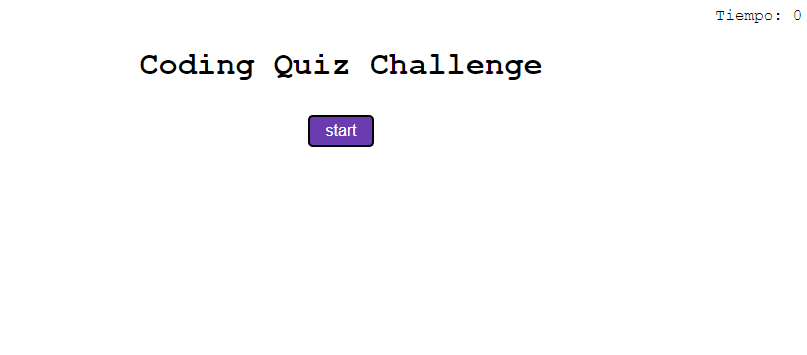
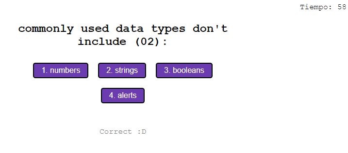

# Coding Quizz
## Challenge Module04  10/Oct/2022
### Último cambio: Mauricio García Hernández 10/Oct/2022

### User Story:
COMO UN estudiante del entrenamiento intensivo en codificación
QUIERO tomar un cuestionario cronometrado sobre los fundamentos de JavaScript que almacena las puntuaciones más altas
PARA QUE pueda medir mi progreso en comparación con mis compañeros

### Criterios de aceptación:
CONSIDERANDO que estoy tomando un cuestionario de código
CUANDO hago clic en el botón de empezar
ENTONCES un cronómetro inicia y se me presenta una pregunta
CUANDO respondo una pregunta
ENTONCES se me presenta con otra pregunta
CUANDO respondo una pregunta incorrectamente
ENTONCES cierto tiempo es restado del reloj
CUANDO todas las preguntas son respondidas o el cronómetro llega a 0 
ENTONCES el juego se termina
CUANDO el juego se termina
ENTONCES puedo guardar mis iniciales y puntaje
GIVEN I am taking a code quiz

* Repositorio: https://github.com/maugh108/coding-quizz
* URL: https://maugh108.github.io/coding-quizz/